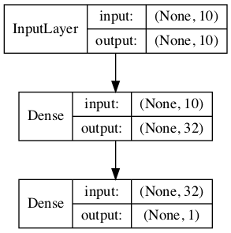
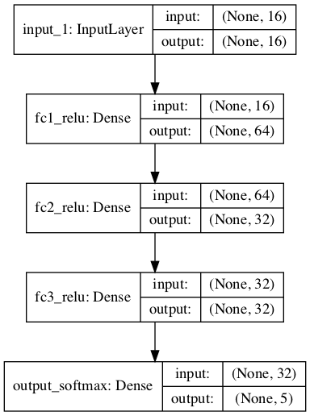
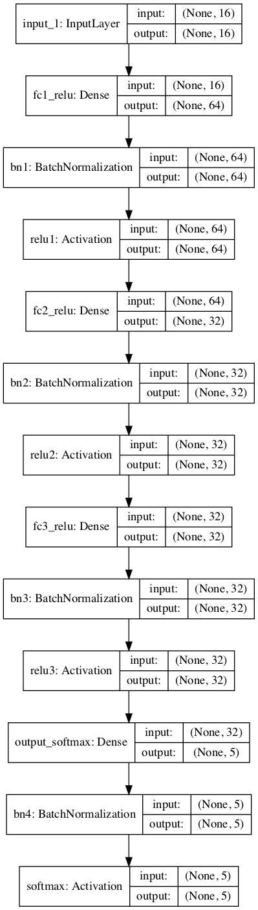

# Keras to HLS

Here we document different keras layers that `hls4ml` supports. We also provide documentation for different example keras models (model `json` file for architecture and `hdf5` file for weights and biases) that can be translated to HLS using `hls4ml` 

## Supported layers

### General limitations:

- `keras.layers.Lambda` is currently not supported.
- Layer's operations on different axes are generally not supported (except for `Concatenate` layer), we are just using the each layer's default axis. 
- Dilations are not supported for convolutional layers.
- We current do not support different data format (using `data_formal = "channels_last"` as default)

### Specific documentations of supported layers (including detailed limitations):

We currently support translations for the following Keras layers. Note that some layers are not fully supported, so we will also provide specific limitations for those layers here:

Core Layers

- `InputLayer`
- `Dropout`
- `Flatten`
- `Dense`:

  - `use_bias = False` is not supported.
  
- `BinaryDense`
- `TernaryDense`

Convolutional Layers

- `Conv1D`:

  - `use_bias = False` is not supported.
  - Dilations are not supported for convolutional layers
  
- `Conv2D`:

  - `use_bias = False` is not supported.
  - Dilations are not supported for convolutional layers
  

Pooling Layers

- `MaxPooling1D`
- `MaxPooling2D`
- `AveragePooling1D`
- `AveragePooling2D`

Normalization Layers

- `BatchNormalization`:

  - `center = True` (add offset to normalized tensor) is not supported
  - Operations on different axes is not supported (always use Keras's default `axis = -1`)

Activation Layers

- `Activation`
- `LeakyReLU`
- `ThresholdedReLU`
- `ELU`
- `PReLU`

Merge Layers

- `Add`
- `Subtract`
- `Multiply`
- `Average`
- `Maximum`
- `Minimum`
- `Concatenate`: 

  - Concatenation is supported up to 3D. 

## Example models

Here we provide detailed documentations for our example Keras models with regard to their architecture, inputs and predictions. All of the example model `json` and `h5` files are stored in `example-keras-model-files`
### [1 layer model](./example-keras-model-files/1-layer-model/)

  

  
  #### Architecture (total params = trainable params = 385):
  
  
  
  #### Example inputs and expected predictions:
  
  
  

### [3-layer models](./example-keras-model-files/3-layer-models/)

  
3 fully-connected layers

  

  
  [Link to directory](./example-keras-model-files/3-layer-models/3-layer)
  
  #### Architecture (total params = trainable params = 4,389):
  
  
  #### Example inputs and expected predictions:
  
  

  
3 fully-connected layers with batch normalization

  

  
  [Link to directory](./example-keras-model-files/3-layer-models/3-layer-batch-norm/)
  
  #### Architecture (Total params: 4,921; Trainable params: 4,655):
  
  
  #### Example inputs and expected predictions:
  
 

